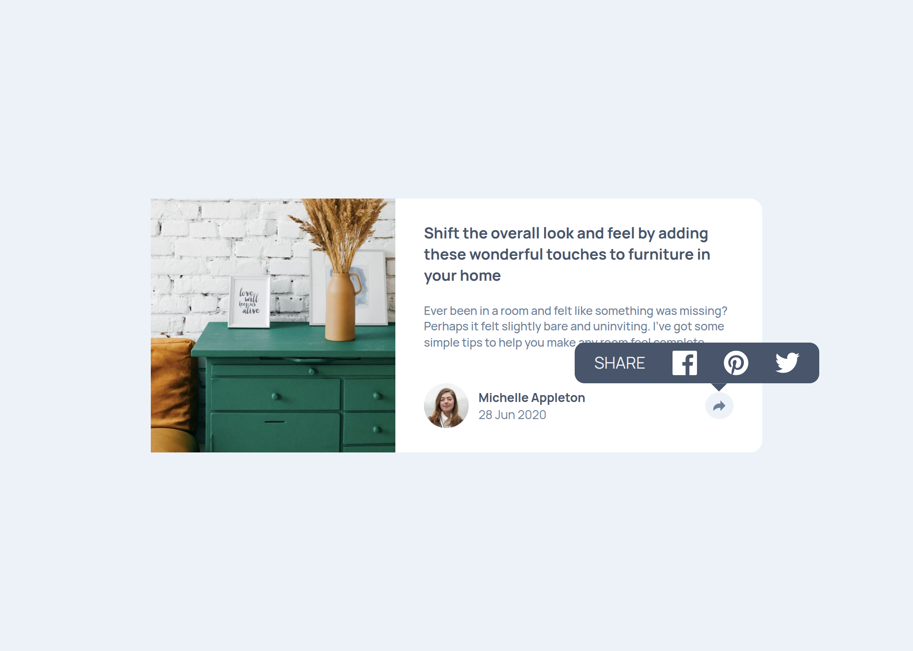

# Frontend Mentor - Article preview component solution

This is a solution to the [Article preview component challenge on Frontend Mentor](https://www.frontendmentor.io/challenges/article-preview-component-dYBN_pYFT)

## Table of contents

- [Overview](#overview)
  - [Screenshot](#screenshot)
  - [Links](#links)
- [My process](#my-process)
  - [Built with](#built-with)
- [Author](#author)

## Overview

### Screenshot

### Desktop

### Mobile
.png)

### Links

- Solution URL: [GitHub](https://github.com/MoDev228/article-preview-component-main)
- Live Site URL: [Article Preview](https://g-akca.github.io/article-preview-component-main/)

## My process

### Built with

- Semantic HTML5 markup
- CSS custom properties
- Flexbox
- Mobile-first workflow

## Author

- GitHub - [@MoDev228](https://github.com/MoDev228)
- Frontend Mentor - [@MoDev228](https://www.frontendmentor.io/profile/MoDev228)
